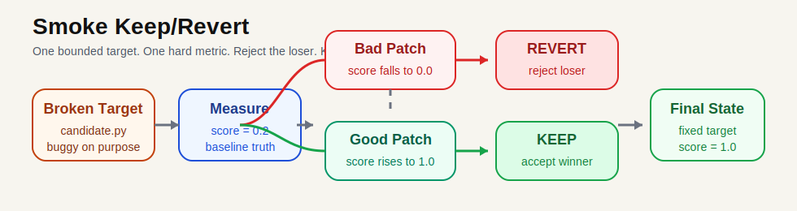

# smoke-keep-revert

Smallest honest example of the framework.



## Files

```text
candidate.py   -> bounded target
measure.py     -> hard score
loop.py        -> keep/revert engine
reset.py       -> restore baseline
results.tsv    -> trial log
proposals/     -> bad patch + good patch
```

## Flow

```text
candidate.py is wrong
   ↓
measure.py scores baseline
   ↓
loop.py applies bad_patch.py
   ↓
score does not improve
   ↓
loop.py reverts the change
   ↓
loop.py applies fix_patch.py
   ↓
score improves
   ↓
loop.py keeps the change
```

## Run

```bash
python reset.py
python loop.py \
  --proposal proposals/bad_patch.py \
  --proposal proposals/fix_patch.py
```
